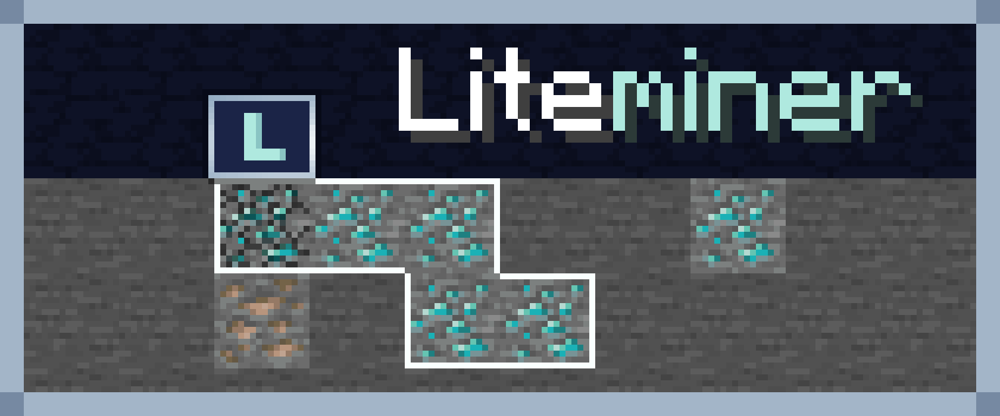

# Liteminer



A veinmining mod for Minecraft.


## ⛏️ About

Liteminer adds configurable vein mining with multiple mining shapes, a HUD, and support for Fabric, Forge, and NeoForge.

## 📦 Features

- Vein mining with multiple shapes (Shapeless, Tunnel, 3×3, Staircase Up/Down)
- Configurable behavior (block limit, tool checks, exhaustion, etc.)
- HUD + keybind workflow
- Tag-based block/tool allow/deny lists (compatible with FTB Ultimine tags)

## 🗂️ Structure

One source tree builds every Minecraft version with [Stonecutter](https://stonecutter.kikugie.dev/):

```
liteminer/
├── common/           # Shared code across loaders
├── fabric/           # Fabric-specific implementation
├── forge/            # Forge-specific implementation
├── neoforge/         # NeoForge-specific implementation
└── versions/         # Per-version properties (1.21.11, 26.1, 26.1.1, 26.1.2, 26.2, 26.3)
```

## 🚀 Supported Versions

Every version in `versions/` builds for Fabric, Forge, and NeoForge: 1.21.11, 26.1, 26.1.1, 26.1.2, 26.2, and 26.3.

## 🛠️ Building

Use `just` from the repo root as the command runner. Nodes are named `<version>-<loader>`.

```bash
# List every buildable node
just list-nodes

# Build one node
just build 26.3-fabric

# Build everything
just build-all

# Run the game for development
just run-client 26.3-neoforge
```

Built jars will be in `<loader>/versions/<version>/build/libs/`.

## 💻 Development

### Prerequisites

- Java 25 (Java 21 for 1.21.11)
- Git
- just (install: `https://github.com/casey/just`)

### Setup

```bash
git clone https://github.com/iamkaf/liteminer.git
cd liteminer
```

Open the repository root in your IDE. The active Stonecutter version is set in `stonecutter.gradle.kts`.

## 🧩 Addon API

Liteminer exposes a public addon API under `com.iamkaf.liteminer.api`.
The API is intended for mods that need to inspect player state, register custom mining shapes, react to
veinmine operations, or adjust the client HUD.

### Reading Liteminer State

Use `LiteminerApi` for server-side player state:

```java
import com.iamkaf.liteminer.api.LiteminerApi;

boolean active = LiteminerApi.isVeinmining(player);
int shapeIndex = LiteminerApi.getSelectedShapeIndex(player);
var selectedShape = LiteminerApi.getSelectedShape(player);
int blockLimit = LiteminerApi.getBlockLimit();
```

You can also set a player's selected shape by id:

```java
import net.minecraft.resources.Identifier;

LiteminerApi.setSelectedShape(player, Identifier.fromNamespaceAndPath("liteminer", "three_by_three"));
```

### Veinmine Events

Server-side lifecycle events live in `com.iamkaf.liteminer.api.event.LiteminerEvents`.

Available events:

- `BEFORE_VEINMINE`: fired before Liteminer processes secondary blocks. Return anything other than `InteractionResult.PASS` to cancel the operation.
- `ALLOW_BLOCK`: fired for each secondary block candidate. Return anything other than `InteractionResult.PASS` to skip that block.
- `AFTER_VEINMINE`: fired after Liteminer finishes processing secondary blocks.

Example:

```java
import com.iamkaf.liteminer.api.event.LiteminerEvents;
import net.minecraft.world.InteractionResult;

LiteminerEvents.ALLOW_BLOCK.register(context -> {
    if (isProtected(context.level(), context.pos(), context.player())) {
        return InteractionResult.FAIL;
    }

    return InteractionResult.PASS;
});
```

Each event context includes the operation type (`BREAK` or `INTERACT`), level, player, origin block,
tool, selected shape, shape index, and block limit. Per-block contexts also include the candidate block.
The after-event context includes the full candidate list, processed blocks, and skipped blocks.

### Custom Shapes

Register custom shapes through `LiteminerShapes`:

```java
import com.iamkaf.liteminer.api.shape.LiteminerShapes;
import net.minecraft.network.chat.Component;
import net.minecraft.resources.Identifier;

LiteminerShapes.register(
        Identifier.fromNamespaceAndPath("examplemod", "vertical_column"),
        Component.literal("Vertical Column"),
        (level, player, origin) -> {
            var blocks = new java.util.HashSet<net.minecraft.core.BlockPos>();
            blocks.add(origin);
            blocks.add(origin.above());
            blocks.add(origin.below());
            return blocks;
        }
);
```

Registered shapes participate in Liteminer's shape cycling, HUD text, block highlighting, and server-side
veinmine logic. Shape walkers should usually include the origin in the returned set; Liteminer skips the
origin when processing secondary blocks.

Built-in shape ids are exposed on `LiteminerShapes`:

- `SHAPELESS`
- `SMALL_TUNNEL`
- `STAIRCASE_UP`
- `STAIRCASE_DOWN`
- `THREE_BY_THREE`

### Client HUD Event

Client-side presentation events live in `com.iamkaf.liteminer.api.event.LiteminerClientEvents`.

Use `MODIFY_HUD` to change or hide Liteminer's default HUD:

```java
import com.iamkaf.liteminer.api.event.LiteminerClientEvents;
import net.minecraft.network.chat.Component;

LiteminerClientEvents.MODIFY_HUD.register(context -> {
    context.lines().add(Component.literal("Addon active"));
    context.setTextColor(0xFF55FF55);
});
```

`LiteminerHudContext` exposes the selected block count, selected shape, mutable HUD lines, visibility,
text color, line height, and screen-center offsets.

## 📝 License

This project is licensed under the MIT License - see the [LICENSE](LICENSE) file for details.

## 🔗 Links

- **CurseForge**: https://www.curseforge.com/minecraft/mc-mods/liteminer
- **Modrinth**: https://modrinth.com/mod/liteminer
- **Issues**: https://github.com/iamkaf/liteminer/issues

## 👤 Author

**iamkaf**

- GitHub: [@iamkaf](https://github.com/iamkaf)
